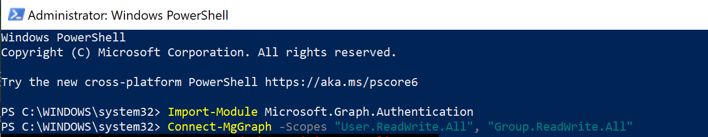

# Managing-Identities-in-Microsoft-Entra-ID-Azure-AD-
This project demonstrates key identity and access management tasks within Microsoft Entra ID (formerly Azure Active Directory), including user creation, group management, role assignment, licensing, and PowerShell automation.

# Managing Identities in Microsoft Entra ID (Azure AD)

This project demonstrates key identity and access management tasks within Microsoft Entra ID (formerly Azure Active Directory), including user creation, group management, role assignment, licensing, and PowerShell automation.

---

## 📌 Project Overview

This hands-on lab simulates common admin tasks performed by IT support and cloud identity professionals. The following operations were completed using the Microsoft Entra Admin Center and Microsoft Graph PowerShell module:

---

## ✅ Key Activities

### 👤 User Creation
- Created a new user **Mansi** in Entra ID with a system-generated password.
- Verified user existence and reviewed their profile status.

### ⚙️ PowerShell Automation
- Imported Microsoft Graph module and authenticated using PowerShell.
- Created a new user **Sara Jones** via script with details like department and job title.
- Retrieved and displayed all users with `Get-MgUser`.

### 🔐 Role Assignments
- Assigned **Global Administrator** role to **Mansi**.
- Assigned **Helpdesk Administrator** role to **Sara Jones**.

### 👥 Group Management
- Created a new group called **Managers**.
- Added Dhanuka, Mansi, and Sara Jones as members.

### 🎫 License Assignment
- Assigned Microsoft Teams Premium license to Mansi.
- Set license location to Australia and verified assignment summary.

---

## 📷 Screenshots

## 📸 Screenshots

---

## 🛠️ Tools & Technologies

- Microsoft Entra Admin Center
- Azure Active Directory (Azure AD)
- Microsoft Graph PowerShell Module
- Windows Terminal / PowerShell
- Microsoft Teams Licensing

---

## 💼 Use Case

This project aligns with real-world scenarios in:
- IT Support & Helpdesk Operations
- Identity & Access Management (IAM)
- Azure AD Administration
- Cloud License Management

---

## 🔗 Author

**Dhanuka**  
📍 Melbourne, Australia  
🎓 Master's in Cybersecurity  
🔗 [LinkedIn](https://www.linkedin.com/in/your-profile) | [GitHub](https://github.com/your-username)
